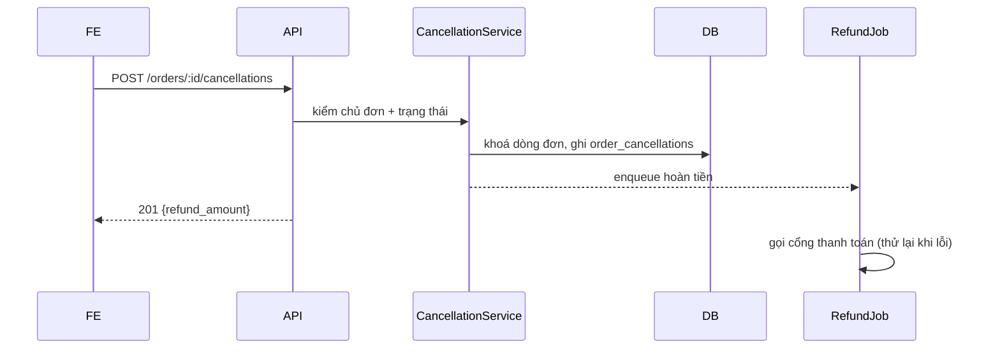

# Sequence: huỷ một phần

```mermaid
sequenceDiagram
  participant FE
  participant API
  participant SV as CancellationService
  participant DB
  participant JOB as RefundJob
  FE->>API: POST /orders/:id/cancellations
  API->>SV: kiểm chủ đơn + trạng thái
  SV->>DB: khoá dòng đơn, ghi order_cancellations
  SV-->>JOB: enqueue hoàn tiền
  API-->>FE: 201 {refund_amount}
  JOB->>JOB: gọi cổng thanh toán (thử lại khi lỗi)
```

Hoàn tiền chạy nền (WHY-3) để request không treo khi cổng thanh toán chậm.
