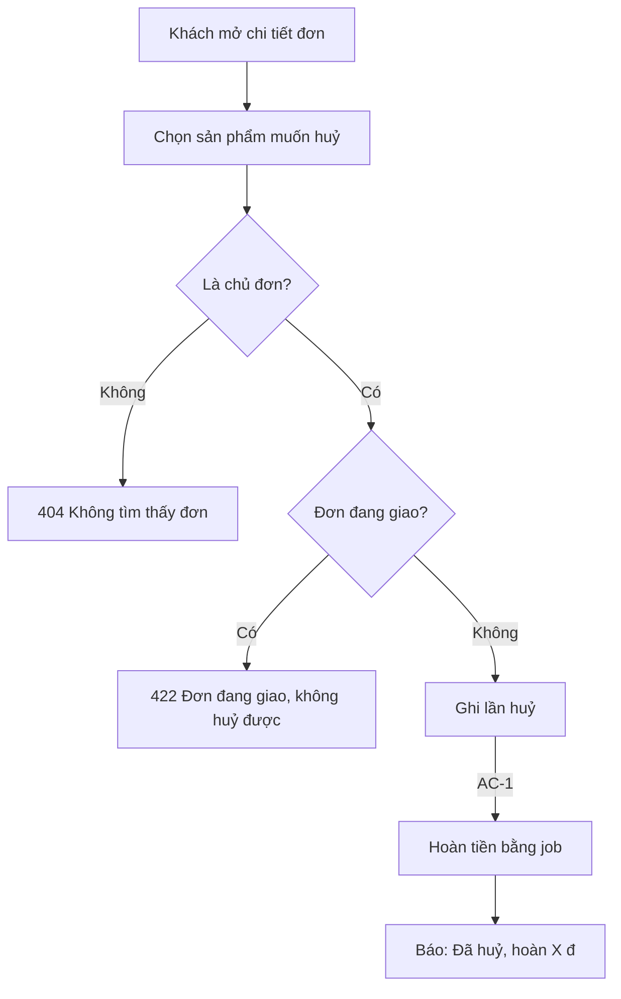

# Workflow: huỷ một phần đơn hàng

Khách huỷ bớt sản phẩm trong đơn đã thanh toán.

```mermaid
flowchart TD
  A["Khách mở chi tiết đơn"] --> B["Chọn sản phẩm muốn huỷ"]
  B --> C{"Là chủ đơn?"}
  C -- Không --> X["404 Không tìm thấy đơn"]
  C -- Có --> D{"Đơn đang giao?"}
  D -- Có --> Y["422 Đơn đang giao, không huỷ được"]
  D -- Không --> E["Ghi lần huỷ"] -->|AC-1| F["Hoàn tiền bằng job"] --> G["Báo: Đã huỷ, hoàn X đ"]
```

AC liên quan: AC-1, AC-2, AC-3.
